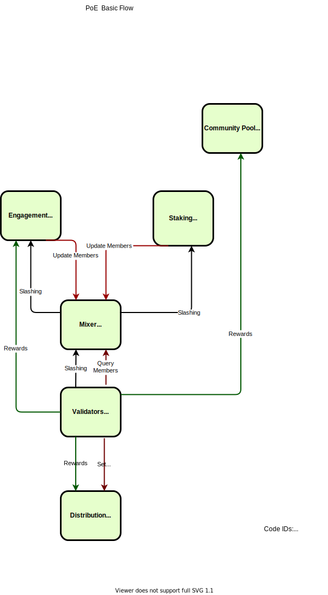
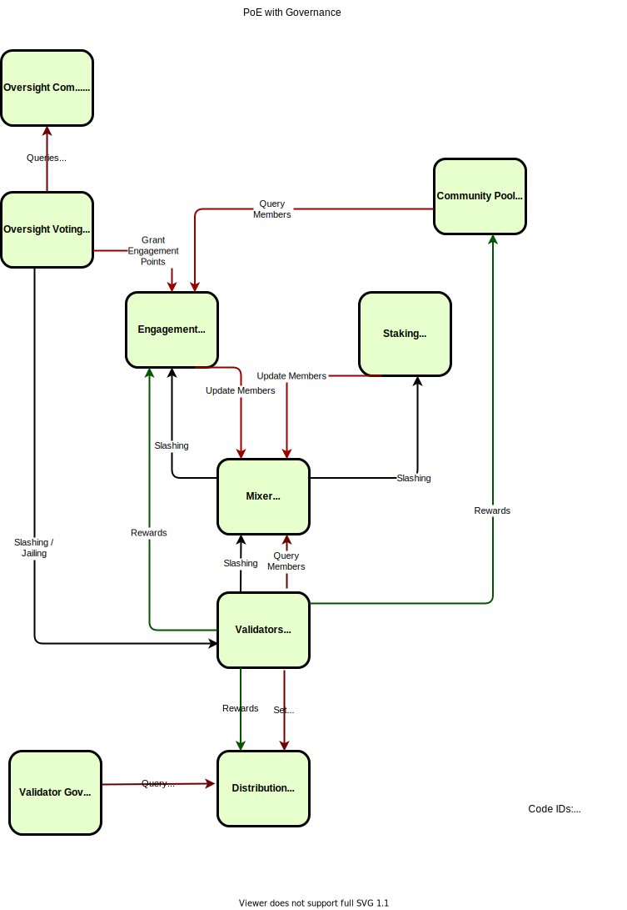

# PoE Contract Achitecture

This provides an overview of how the PoE contracts fit together in a running Tgrade blockchain.

## Basic Architecture

First, we look how the flow of voting power (points) and rewards (tokens) goes, without taking into
account the governance processes.

In this diagram, red arrows demonstrate "points". These are not transferable counts on addresses,
sometimes refered to as "power".  Be it "Engagement Points", the Points you get from staked tokens,
or the "Validator Power" computer by mixing these two.

Green arrows indicate flow of TGD tokens. They come in to the valset contract from fees and minting block
rewards, and are distributed to other contracts via these lines. Black arrows indictates punishment or slashing.
This is a reduction of "Engagement Points" or of the staked tokens (and their associated validator power).

## Principle Actors

From this diagam, we can observe the flow of Points that control the validation / consensus:

* People have Engagement Points in the tg4-engagement contract
* People can stake TGD toklens in the tg4-stake contract to get Staking Points
* tg4-mixer mixes Engagement Points and Staking Points to produce Validation Points
* tg4-valset grabs the top (unjailed) validators by points and uses that to assign their Validator Power in Tendermint (active validators)

This is the flow of Rewards (TGD) that the blockchain gives to people that keep it running well:

* Block rewards (TGD) are calculated every epoch based on fees and inflation (minting tokens) - collection and minting done by valset
* These TGD are split between 2 contracts: a distribution contract (based on Validator Weight) and the engagment contract (based on Engagement Points).
* Both of these contracts use cw2222 to keep a counter of how many tokens everyone is entitled to in an efficient way (one update to deposit, one update on withdraw, one update when changing the point value)
* Validator (operators) can withdraw their rewards from the distribution contract
* Engagement Point holders can withdraw their rewards from the engagement contract
* Community Pool collects some small part of rewards that can be distributed via governance

Cw2222 is based on ERC2222, and can be used to efficiently and lazily distribute rewards to people based on their
points, even when those points/balances change over time.

On this level, the only slashing condition is double-signing (more specifically, any "Evidence" in a Tendermint Block
Header). The slashing percentage will be set at 50% on chain genesis.

## Multi-Level Governance

On top of this base layer, we add a number of different governance contracts with different roles:

The "Oversight Community" is a Form of "Trusted Circle", which has an associated privileged voting contract,
allowing members to vote on critical chain updates. These include:

* Granting Engagement Points
* Punishing Misbehaving Validators (slashing or jailing) for actions besides double-signing
* Unjailing Validators (if they can prove they were innocent)

The "Community Pool" is a simple voting contract, using Engagement Point holders for membership. It receives
tokens from the block rewards and can vote to send them to any address that they deem important. This can be used
to fund various initiatives to support the chain - from relayers to marketing to a block explorer. Giving
autonomy to the Engagement Point holders.

There is also a "Validator Voting Contract", which is based on membership in the current active validators set.
This governance contract can perform the following actions related to the operations of an efficiently running chain:

* Set an upgrade plan (using `x/upgrade`), to plan an upgrade of the binary
* Cancel a pending upgrade
* Set Tendermint Consensus Parameters (eg. max block size, max block gas)
* Pin/Unpin Contracts (this keeps popular contracts in cache, lowering gas and runtime)
* Set `x/params`, such as enabling IBC.

On genesis, the only way to migrate the PoE contracts is via a chain upgrade with custom migration code
written in Go. We consider allowing more governance voting types in the future, but want to start with a
minimal necessary set, in that running a chain upgrade with a custom migration code can perform any state
transition and serves as a backup plan for anything not explicitly covered above (albeit inefficient).

