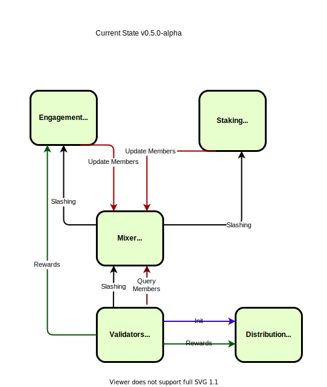

# Contract Achitecture

An overview how all these pieces fit together in a deployed blockchain.

The current state (without governance, but with slashing):

Once governance fits in:

TODO: details on how to wire together modules and grant who admin privileges on whom?
